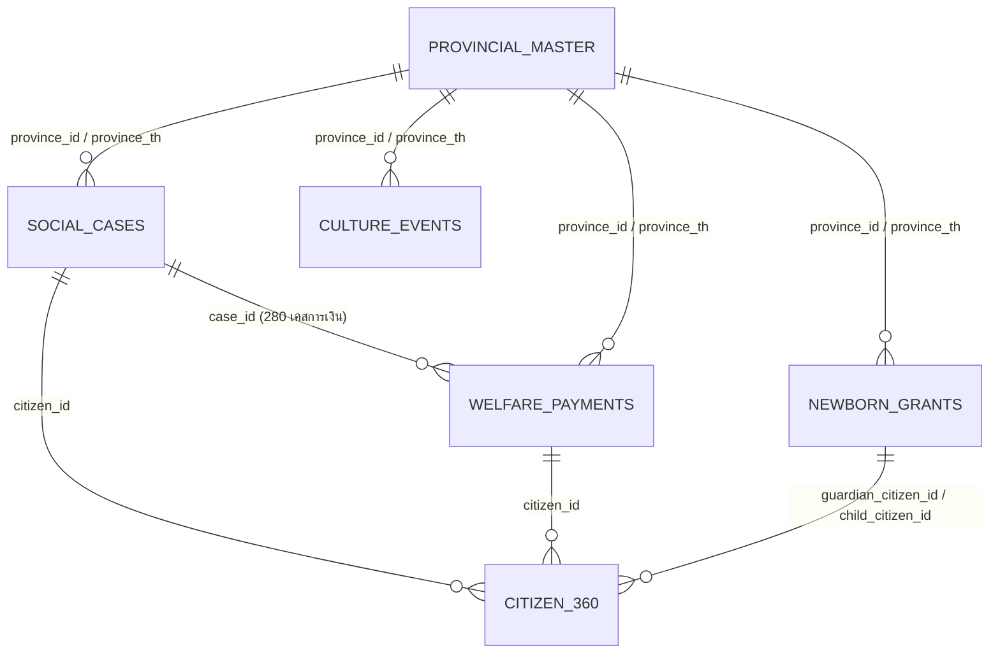

# เอกสารประกอบชุดข้อมูล: ข้อมูลสวัสดิการสังคม (พม.) & ปฏิทินวัฒนธรรม (วธ.)
**โฟลเดอร์:** `group_6/`  
**จัดทำโดย:** ระบบแปลงข้อมูลอัตโนมัติ (Antigravity Data Pipeline)

---

## 1. ภาพรวมของชุดข้อมูลในโฟลเดอร์ (Overview & Data Sources)

ในโฟลเดอร์ `group_6/` ประกอบด้วยชุดข้อมูลสวัสดิการสังคมและวัฒนธรรม **4 ชุดข้อมูลหลักจาก 2 กระทรวง**:

| ชุดข้อมูล | หน่วยงานเจ้าของข้อมูล | ลักษณะข้อมูล | ขนาดข้อมูล | ไฟล์ผลลัพธ์ (.csv) |
| :--- | :--- | :---: | :---: | :--- |
| **1. ผู้ประสบปัญหาทางสังคมที่ได้รับความช่วยเหลือ** | **กระทรวงการพัฒนาสังคมและความมั่นคงของมนุษย์ (พม.)** | Synthetic Data | 500 Records | `clean_mso_social_cases.csv` |
| **2. การช่วยเหลือเงินสงเคราะห์** | **กระทรวงการพัฒนาสังคมและความมั่นคงของมนุษย์ (พม.)** | Synthetic Data | 500 Records | `clean_mso_welfare_payments.csv` |
| **3. เงินอุดหนุนเด็กแรกเกิด** | **กระทรวงการพัฒนาสังคมและความมั่นคงของมนุษย์ (พม.)** | Synthetic Data | 500 Records | `clean_mso_newborn_grants.csv` |
| **4. ฐานข้อมูลประชาชนแบบองค์รวม (Citizen 360)** | **ประมวลผลบูรณาการภายใน พม.** | Derived Master | 420 บุคคล | `clean_mso_citizen_360.csv` |
| **5. ปฏิทินเทศกาลประเพณีและกิจกรรมสำคัญ** | **กระทรวงวัฒนธรรม (วธ.)** | Real Open Data (API) | 200 กิจกรรม | `clean_culture_events.csv` |
| **6. ตารางสรุปบูรณาการระดับจังหวัด (77 จังหวัด)** | **บูรณาการข้ามกระทรวง (พม. x วธ.)** | Integrated Master | 77 จังหวัด | `provincial_integrated_master.csv` |

---

## 2. โครงสร้างโฟลเดอร์ (Directory Structure)

```
group_6/
├── raw/                                         # ข้อมูลดิบต้นฉบับ
│   ├── data_พม.rar                              # ไฟล์บีบอัดของ พม.
│   ├── events.json                              # JSON ข้อมูลเปิดของ วธ.
│   ├── การช่วยเหลือเงินสงเคราะห์/
│   │   ├── datadict_mso_welfare_payments.xlsx   # พจนานุกรมข้อมูลต้นฉบับ
│   │   └── mso_welfare_payments_500.csv
│   ├── ผู้ประสบปัญหาทางสังคมที่ได้รับความช่วยเหลือ/
│   │   ├── datadict_mso_social_cases_assisted.xlsx
│   │   └── mso_social_cases_assisted_500.csv
│   └── เด็กแรกเกิด - การจ่ายเงินอุดหนุนเด็กแรกเกิด/
│       ├── datadict_mso_newborn_child_grant.xlsx
│       └── mso_newborn_child_grant_500.csv
├── clean/                                       # ไฟล์ Clean CSV มาตรฐาน UTF-8-sig
│   ├── clean_mso_social_cases.csv               # 500 แถว x 36 คอลัมน์ (พร้อม SLA วันดำเนินการ, กลุ่มอายุ, ภาค)
│   ├── clean_mso_welfare_payments.csv           # 500 แถว x 41 คอลัมน์ (พร้อม % การจ่าย, ยอดคงค้าง, วันอนุมัติ-จ่าย)
│   ├── clean_mso_newborn_grants.csv             # 500 แถว x 42 คอลัมน์ (พร้อมรายได้ครัวเรือนรวม, วงเงิน, ช่วงรายได้)
│   ├── clean_mso_citizen_360.csv                # 420 แถว x 23 คอลัมน์ (Single View of Citizen เชื่อมโยงข้ามโครงการ)
│   ├── clean_culture_events.csv                 # 200 แถว x 37 คอลัมน์ (Clean HTML, Map หมวดหมู่, Impute พิกัด)
│   └── provincial_integrated_master.csv         # 77 แถว x 21 คอลัมน์ (สรุปสถิติ 77 จังหวัด เชื่อม พม. x วธ.)
├── process_clean_csv.py                         # สคริปต์ Data Pipeline ทำความสะอาดและแปลงข้อมูล
└── README.md
```

---

## 3. ความสัมพันธ์และการเชื่อมโยงข้อมูล (Relational Data Model)



---

## 4. รายละเอียดชุดข้อมูลที่ผ่านการ Clean แล้ว (Clean Datasets Summary)

### 1. `clean_mso_social_cases.csv`
- **Grain:** 1 Record = 1 Case การขอรับความช่วยเหลือ
- **คอลัมน์สำคัญที่ Derive เพิ่ม:**
  - `days_to_assistance`: ระยะเวลาตั้งแต่ยื่นเรื่องถึงวันที่ให้ความช่วยเหลือ
  - `days_to_close`: ระยะเวลาปิดเคสทั้งหมด (SLA วันทำการ)
  - `age_at_request`, `age_group`: อายุ ณ วันที่ร้องขอ และกลุ่มช่วงวัย
  - `region`, `province_en`, `province_id`: ภูมิภาคและรหัสจังหวัดมาตรฐาน

### 2. `clean_mso_welfare_payments.csv`
- **Grain:** 1 Record = 1 งวดการเบิกจ่ายเงินสงเคราะห์ (Transaction)
- **คอลัมน์สำคัญที่ Derive เพิ่ม:**
  - `days_to_approval`, `days_to_payment`, `approval_to_payment_days`: วัดประสิทธิภาพกระบวนการเบิกจ่าย
  - `payment_pct`: สัดส่วนเงินที่จ่ายจริงเทียบกับยอดอนุมัติ (%)
  - `unpaid_amount`: ยอดเงินคงค้างที่ยังไม่เบิกจ่าย

### 3. `clean_mso_newborn_grants.csv`
- **Grain:** 1 Record = 1 งวดการจ่ายเงินอุดหนุนเด็กแรกเกิด
- **คอลัมน์สำคัญที่ Derive เพิ่ม:**
  - `days_app_to_approval`, `days_app_to_payment`: ระยะเวลาการพิจารณาสิทธิ์
  - `child_age_at_payment_months`: อายุเด็ก ณ วันที่จ่ายเงิน (เดือน)
  - `household_total_monthly_income`: รายได้ครัวเรือนรวมต่อเดือน (คำนวณจากรายได้ต่อหัว x จำนวนสมาชิก)
  - `income_bracket`: กลุ่มระดับความยากจนของครัวเรือน

### 4. `clean_mso_citizen_360.csv`
- **Grain:** 1 Record = 1 บุคคลผู้รับบริการ (Citizen-Centric Master)
- **คุณประโยชน์:** รวมประวัติการรับบริการทุกด้าน, ยอดเงินช่วยเหลือสะสม (`total_aid_received`), สถิติเคสฉุกเฉิน และการระบุกลุ่มผู้รับสวัสดิการหลายโครงการ (`is_multi_program_beneficiary`)

### 5. `clean_culture_events.csv`
- **Grain:** 1 Record = 1 กิจกรรมทางวัฒนธรรม/เทศกาล
- **การปรับปรุงคุณภาพข้อมูล:**
  - **Clean HTML:** ถอดรหัส HTML entities และตัด Tags สไตล์ตกค้าง ให้เหลือข้อความที่พร้อมทำ NLP/Text Mining
  - **Category Standard:** ถอดรหัส `event_category` ให้อยู่ในชื่อหมวดภาษาไทยชัดเจน (เช่น ประเพณีและศาสนา, เทศกาลประจำปี, อาหารและวิถีชีวิต)
  - **Geocoding Imputation:** แก้ไขปัญหาพิกัดตกค้าง (`13.766913, 100.576203`) ด้วยพิกัดจุดกึ่งกลางจังหวัด (Provincial Centroid) พร้อมระบุ `coord_source`

### 6. `provincial_integrated_master.csv`
- **Grain:** 1 Record = 1 จังหวัด (ครอบคลุมครบ 77 จังหวัดทั่วไทย)
- **คุณประโยชน์:** เชื่อมโยงมิติความเปราะบางทางสังคม (พม.) เข้ากับมิติต้นทุนทางวัฒนธรรมและเทศกาล (วธ.) เพื่อการวิเคราะห์เชิงพื้นที่และเสนอแนะเชิงนโยบาย
