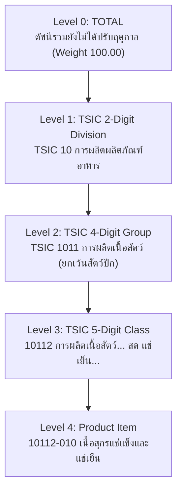

# เอกสารประกอบชุดข้อมูล: ดัชนีราคาผู้ผลิต & ดัชนีการส่งสินค้า
**โฟลเดอร์:** `group_5/`  
**จัดทำโดย:** ระบบแปลงข้อมูลอัตโนมัติ (Antigravity Data Pipeline)

---

## 1. ภาพรวมของชุดข้อมูลในโฟลเดอร์ (Overview & Data Sources)

ในโฟลเดอร์ `group_5/` ประกอบด้วยชุดข้อมูลเศรษฐกิจและอุตสาหกรรม **2 ประเภทหลักจาก 2 หน่วยงานที่แตกต่างกัน**:

| ชุดข้อมูล | หน่วยงานเจ้าของข้อมูล | มาตรฐานการจัดหมวดหมู่ | ปีฐาน | ไฟล์ต้นฉบับ (.xlsx) |
| :--- | :--- | :--- | :---: | :--- |
| **1. ดัชนีราคาผู้ผลิต (PPI)** | **สำนักงานนโยบายและยุทธศาสตร์การค้า (สนค.) กระทรวงพาณิชย์** | **CPA** (Classification of Products by Activity) | 2564 = 100 | • `ดัชนีราคาผู้ผลิต_(เม.ย 69).xlsx`<br>• `ดัชนีราคาผู้ผลิต_(พ.ค 69).xlsx`<br>• `ดัชนีราคาผู้ผลิต_(มิ.ย 69).xlsx` |
| **2. ดัชนีการส่งสินค้า (Shipment Index)** | **สำนักงานเศรษฐกิจอุตสาหกรรม (สศอ.) กระทรวงอุตสาหกรรม** | **TSIC** (Thailand Standard Industrial Classification) | 2559 = 100 | • `Shipment.xlsx` |

---

```
group_5/
├── raw/                                 # ไฟล์ Excel (.xlsx) ต้นฉบับที่ดาวน์โหลดมา
│   ├── Shipment.xlsx
│   ├── ดัชนีราคาผู้ผลิต_(เม.ย 69).xlsx
│   ├── ดัชนีราคาผู้ผลิต_(พ.ค 69).xlsx
│   └── ดัชนีราคาผู้ผลิต_(มิ.ย 69).xlsx
├── clean_csv/                           # ไฟล์ Clean CSV มาตรฐาน UTF-8-sig
│   ├── ppi_monthly_2026_04.csv          # PPI รายงานประจำเดือน เม.ย. 2569 (90 แถว)
│   ├── ppi_monthly_2026_05.csv          # PPI รายงานประจำเดือน พ.ค. 2569 (90 แถว)
│   ├── ppi_monthly_2026_06.csv          # PPI รายงานประจำเดือน มิ.ย. 2569 (90 แถว)
│   ├── ppi_timeseries_master.csv        # PPI รวมทุกเดือนแบบ Wide Format (270 แถว)
│   ├── ppi_tidy_timeseries.csv          # PPI รูปแบบ Tidy Long Format (270 แถว)
│   ├── shipment_index_wide.csv          # Shipment Matrix 66 เดือนแบบ Wide Format (523 แถว x 83 คอลัมน์)
│   └── shipment_index_tidy_timeseries.csv # Shipment รูปแบบ Tidy Long Format (34,518 แถว x 22 คอลัมน์)
├── fonts/Prompt/                        # 🔤 18 ไฟล์ TTF — จำเป็นสำหรับ matplotlib ภาษาไทย (ห้ามลบ)
├── data_analysis.ipynb                  # 📊 Full Analytics: PPI + Shipment 4-Quadrant & Forecast
├── ppi_data_analysis.ipynb              # 🏭 Dedicated PPI Analytics: Cost-Push Inflation & Sectoral Analysis
├── ppi_ml_modeling.ipynb                # 🚀 PPI Supervised ML: Lag Features → Regression + Classification
├── shipment_data_analysis.ipynb         # 🚢 Masterpiece Shipment Analytics: 66-Month TSIC Analytics & Holt-Winters Forecasting
├── shipment_goal_analysis.ipynb         # 🎯 Targeted Shipment Analytics: Macro Trends, Deepest Top 10 & Electronics Deep Dive
├── TSIC_SHIPMENT_VALIDATION_REPORT.md   # 📑 Official TSIC Validation Report (เทียบเคียงคู่มือ สสช. 2 เล่ม)
└── README.md
```

---

## 3. ชุดข้อมูลที่ 1: ดัชนีราคาผู้ผลิต (PPI - กระทรวงพาณิชย์)

### ก. การจำแนกโครงสร้างลำดับชั้น (CPA Taxonomy)
- **Level 0 (Total):** `รวมทุกรายการ` (ยอดรวมทั้งประเทศ)
- **Level 1 (Major Sector):** 3 ภาคหลัก ได้แก่ `ผลิตภัณฑ์เกษตรกรรม และการประมง`, `ผลิตภัณฑ์จากเหมือง`, `ผลิตภัณฑ์อุตสาหกรรม`
- **Level 2 (Product Group):** 32 กลุ่มสินค้าหลัก
- **Level 3 (Subgroup Item):** 54 รายการสินค้าย่อย

### ข. Data Dictionary ของไฟล์ PPI:

| ชื่อคอลัมน์ | ชนิดข้อมูล | ที่มาและการแปลงข้อมูล |
| :--- | :---: | :--- |
| `period_ym` | String | แปลงจาก `ระยะเวลา [เดือน] [พ.ศ.]` ➔ ISO `YYYY-MM` (เช่น `2026-05`) |
| `year_ce` / `year_be` | Integer | ปี ค.ศ. (`2026`) / ปี พ.ศ. (`2569`) |
| `month_num` / `month_name_th` | Int / Str | เลขเดือน (`1..12`) / ชื่อเดือนไทย (`พฤษภาคม`) |
| `row_order` | Integer | ลำดับแถวเดิมในรายงาน (`1..90`) |
| `category_level` | Integer | ระดับชั้นโครงสร้าง CPA (`0..3`) |
| `sector` | String | ชื่อภาคการผลิตหลัก (Level 1) |
| `group_name` | String | ชื่อกลุ่มสินค้าหลัก (Level 2) |
| `category_name` | String | ชื่อสินค้าในแถวนั้นๆ |
| `index_current_month` | Float | ดัชนีราคาของเดือนที่รายงาน |
| `index_prev_month` | Float | ดัชนีราคาของเดือนก่อนหน้า |
| `index_prev_year_same_month` | Float | ดัชนีราคาของเดือนเดียวกันปีก่อนหน้า |
| `mom_change_pct` | Float | อัตราการเปลี่ยนแปลงเทียบเดือนก่อนหน้า (MoM %) |
| `yoy_change_pct` | Float | อัตราการเปลี่ยนแปลงเทียบเดือนเดียวกันปีก่อน (YoY %) |
| `aoa_change_pct` | Float | อัตราการเปลี่ยนแปลงเฉลี่ยสะสม (AoA %) |
| `base_year` | String | ปีฐานอ้างอิง (`2564 = 100`) |
| `source_file` | String | ชื่อไฟล์ Excel ต้นฉบับ |

---

## 4. ชุดข้อมูลที่ 2: ดัชนีการส่งสินค้า (Shipment Index - กระทรวงอุตสาหกรรม / สศอ.)

### ก. การถอดรหัสและการแปลงโครงสร้าง TSIC (TSIC Code Transformation)

ในไฟล์ `Shipment.xlsx` ข้อมูลสินค้า 523 รายการ จัดหมวดหมู่ตามมาตรฐาน **TSIC (Thailand Standard Industrial Classification)** ซึ่งระบบแปลงข้อมูลได้แยกออกเป็น 5 ระดับชั้นพร้อมสร้างรหัสอ้างอิงชัดเจน:



#### รายละเอียดโครงสร้างระดับชั้น (Hierarchy Levels):

1. **Level 0 (`TOTAL` - 1 แถว):**
   - ดัชนีภาพรวมทั้งประเทศ (`ดัชนีรวมยังไม่ได้ปรับฤดูกาล`), ค่าน้ำหนัก = `100.00`
2. **Level 1 (`DIVISION_2DIGIT` - 22 แถว):**
   - **รหัสหมวด TSIC 2 หลัก** (`tsic_division_code` เช่น `10`, `11`, `20`)
   - ถอดรหัสจากข้อความ `TSIC : 10 การผลิตผลิตภัณฑ์อาหาร` ➔ `tsic_division_code = '10'`, `tsic_division_name = 'การผลิตผลิตภัณฑ์อาหาร'`
3. **Level 2 (`GROUP_4DIGIT` - 75 แถว):**
   - **รหัสหมู่ย่อย TSIC 4 หลัก** (`tsic_group_code` เช่น `1011`, `1012`)
   - ถอดรหัสจากข้อความ `TSIC : 1011 การผลิตเนื้อสัตว์ (ยกเว้นสัตว์ปีก)` ➔ `tsic_group_code = '1011'`, `tsic_group_name = 'การผลิตเนื้อสัตว์ (ยกเว้นสัตว์ปีก)'`
4. **Level 3 (`CLASS_5DIGIT` - 136 แถว):**
   - **รหัสกิจกรรม TSIC 5 หลัก** (`tsic_class_code` เช่น `10112`, `10120`)
   - ถอดรหัสจากข้อความ `10112 การผลิตเนื้อสัตว์...` ➔ `tsic_class_code = '10112'`, `tsic_class_name = 'การผลิตเนื้อสัตว์... สด แช่เย็น...'`
5. **Level 4 (`PRODUCT_ITEM` - 289 แถว):**
   - **สินค้ารายการย่อยระดับล่างสุด**
   - ถอดรหัสจากคอลัมน์ A (รหัส Class 5 หลัก e.g. `10112`) + คอลัมน์ B (รหัสสินค้าย่อย 3 หลัก e.g. `010`) ➔ สร้างเป็นรหัสผสม **`product_code = '10112-010'`** และชื่อสินค้า `item_name = 'เนื้อสุกรแช่แข็งและแช่เย็น'`

---

### ข. ตัวอย่างการแปลงข้อมูลจาก Excel ต้นฉบับสู่ Clean CSV:

| ข้อมูลใน Excel (Row & Col A, B, C) | `category_level` | `level_type` | `tsic_division_name` | `tsic_group_name` | `tsic_class_name` | `product_code` | `item_name` |
| :--- | :---: | :--- | :--- | :--- | :--- | :--- | :--- |
| `R06: [ ][ ][ดัชนีรวมยังไม่ได้ปรับฤดูกาล]` | **0** | `TOTAL` | ดัชนีรวม... | - | - | - | ดัชนีรวมยังไม่ได้ปรับฤดูกาล |
| `R07: [ ][ ][TSIC : 10 การผลิตผลิตภัณฑ์อาหาร]` | **1** | `DIVISION_2DIGIT` | การผลิตผลิตภัณฑ์อาหาร | - | - | - | การผลิตผลิตภัณฑ์อาหาร |
| `R08: [ ][ ][TSIC : 1011 การผลิตเนื้อสัตว์...]` | **2** | `GROUP_4DIGIT` | การผลิตผลิตภัณฑ์อาหาร | การผลิตเนื้อสัตว์... | - | - | การผลิตเนื้อสัตว์... |
| `R09: [ ][ ][10112 การผลิตเนื้อสัตว์...]` | **3** | `CLASS_5DIGIT` | การผลิตผลิตภัณฑ์อาหาร | การผลิตเนื้อสัตว์... | การผลิตเนื้อสัตว์... สด... | - | การผลิตเนื้อสัตว์... สด... |
| `R10: [10112][010][เนื้อสุกรแช่แข็งและแช่เย็น]` | **4** | `PRODUCT_ITEM` | การผลิตผลิตภัณฑ์อาหาร | การผลิตเนื้อสัตว์... | การผลิตเนื้อสัตว์... สด... | **`10112-010`** | **เนื้อสุกรแช่แข็งและแช่เย็น** |

---

### ค. มิติเวลา (Time Horizon)
ครอบคลุมข้อมูลรายเดือนรวม **66 เดือน** ตั้งแต่ **มกราคม 2564 ถึง มิถุนายน 2569** (ปี 2564-2568 ครบ 12 เดือน และปี 2569 ม.ค.-มิ.ย.)

---

### ง. Data Dictionary ของไฟล์ Shipment:

#### 1. `shipment_index_wide.csv` (Wide Matrix: 523 แถว x 83 คอลัมน์)
- **คอลัมน์ระบุกลุ่ม:** `row_order`, `category_level`, `level_type`, `tsic_division_code`, `tsic_division_name`, `tsic_group_code`, `tsic_group_name`, `tsic_class_code`, `tsic_class_name`, `product_code`, `item_name`, `weight`
- **คอลัมน์ดัชนีรายเดือน (66 คอลัมน์):** `index_2021_01`, `index_2021_02`, ..., `index_2026_06`
- **คอลัมน์สรุปการเปลี่ยนแปลง:** `mom_change_pct`, `yoy_change_pct`
- **Metadata:** `base_year`, `source_agency`, `source_file`

#### 2. `shipment_index_tidy_timeseries.csv` (Tidy Format: 34,518 แถว x 22 คอลัมน์)
เหมาะที่สุดสำหรับ **SQL Database, BI Dashboards (Power BI / Tableau), และการสร้างโมเดลพยากรณ์ Time-Series**:

| ชื่อคอลัมน์ | ชนิดข้อมูล | ตัวอย่าง | คำอธิบาย |
| :--- | :---: | :--- | :--- |
| `period_ym` | String | `2026-05` | รอบระยะเวลาปี-เดือนมาตรฐานสากล |
| `year_ce` / `year_be` | Integer | `2026` / `2569` | ปี ค.ศ. / ปี พ.ศ. |
| `month_num` / `month_name_th` | Int / Str | `5` / `พฤษภาคม` | เลขเดือน / ชื่อเดือนไทย |
| `row_order` | Integer | `10` | ลำดับแถวของรายการในรายงาน (`1..523`) |
| `category_level` | Integer | `4` | ระดับความลึกในโครงสร้าง TSIC (`0..4`) |
| `level_type` | String | `PRODUCT_ITEM` | ประเภทระดับชั้น (`TOTAL`, `DIVISION_2DIGIT`, `GROUP_4DIGIT`, `CLASS_5DIGIT`, `PRODUCT_ITEM`) |
| `tsic_division_code` | String | `10` | รหัสหมวด TSIC 2 หลัก |
| `tsic_division_name` | String | `การผลิตผลิตภัณฑ์อาหาร` | ชื่อหมวดอุตสาหกรรม |
| `tsic_group_code` | String | `1011` | รหัสหมู่ย่อย TSIC 4 หลัก |
| `tsic_group_name` | String | `การผลิตเนื้อสัตว์ (ยกเว้นสัตว์ปีก)` | ชื่อหมู่ย่อยอุตสาหกรรม |
| `tsic_class_code` | String | `10112` | รหัสกิจกรรม TSIC 5 หลัก |
| `tsic_class_name` | String | `การผลิตเนื้อสัตว์... สด แช่เย็น...` | ชื่อกิจกรรมอุตสาหกรรม |
| `product_code` | String | `10112-010` | รหัสผลิตภัณฑ์รายตัว (Class 5 หลัก + Subcode 3 หลัก) |
| `item_name` | String | `เนื้อสุกรแช่แข็งและแช่เย็น` | ชื่อรายการสินค้า |
| `weight` | Float | `0.290882` | ค่าน้ำหนักในตะกร้าดัชนี (%) |
| `shipment_index` | Float | `100.316355` | ค่าดัชนีการส่งสินค้าของเดือนนั้นๆ |
| `is_preliminary` | Boolean | `False` | ค่า `True` สำหรับข้อมูลเบื้องต้น (เช่น มิ.ย. 2569 ที่มีเครื่องหมาย `*`) |
| `base_year` | String | `2559 = 100` | ปีฐานอ้างอิง |
| `source_agency` | String | `สำนักงานเศรษฐกิจอุตสาหกรรม (สศอ.) กระทรวงอุตสาหกรรม` | หน่วยงานเจ้าของข้อมูล |
| `source_file` | String | `Shipment.xlsx` | ไฟล์ต้นฉบับ |

---

## 5. วิธีการรันโปรแกรมแปลงข้อมูล & ตรวจสอบความถูกต้อง

> ⚠️ **สคริปต์ย้ายที่แล้ว** — pipeline ทั้งหมดอยู่ใน `DGA_3/scripts/` และยังอ้าง path ข้อมูลแบบ relative
> จาก root ของ `DGA_3/` ดังนั้น **ต้อง `cd DGA_3` ก่อนรันทุกครั้ง**

### 1. รันการแปลงข้อมูล (Pipeline Execution):
```powershell
cd DGA_3

# แปลงข้อมูลดัชนีราคาผู้ผลิต (PPI)
.\venv\Scripts\python.exe scripts\process_price_index.py

# แปลงข้อมูลดัชนีการส่งสินค้า (Shipment)
.\venv\Scripts\python.exe scripts\process_shipment.py
```

### 2. รันการตรวจสอบความถูกต้องของข้อมูล (Automated Validation):
```powershell
cd DGA_3

# ตรวจสอบความถูกต้องของข้อมูล PPI
.\venv\Scripts\python.exe scripts\validate_output.py

# ตรวจสอบความถูกต้องของข้อมูล Shipment
.\venv\Scripts\python.exe scripts\validate_shipment.py
```
สคริปต์ตรวจสอบจะเปรียบเทียบข้อมูลทุกแถวและทุกตัวเลขในไฟล์ CSV กับไฟล์ Excel ต้นฉบับแบบ 1:1 เพื่อรับประกันความถูกต้องแม่นยำ 100%

---

## 🐛 Known Issues & Lessons Learned

| Bug ID | อาการ / Symptom | แก้ไข / Fix |
|---|---|---|
| **BUG-001** | Plotly `'iframe'` renderer ไม่แสดงผลใน VS Code Jupyter | เปลี่ยนเป็น `import plotly.io as pio; pio.renderers.default = 'notebook'` |
| **BUG-002** | Plotly Category Mismatch / Empty data จากช่องว่างซ้ำซ้อนและ Data Type | เพิ่ม `.str.replace(r'  +', ' ', regex=True)` หลัง `.str.strip()` และ normalize รหัสหมวด TSIC ให้เป็น string 2 หลัก |

