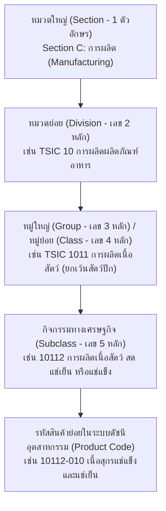

# 📑 รายงานการตรวจสอบมาตรฐาน TSIC 2552 & การสอบทานชุดข้อมูล Shipment Index
**โฟลเดอร์:** `group_5/`  
**จัดทำโดย:** ระบบตรวจสอบความถูกต้องของข้อมูลอุตสาหกรรม (Antigravity Data Validation Subsystem)  
**อ้างอิงเอกสารทางการจาก สำนักงานสถิติแห่งชาติ (สสช.):**
1. 📘 **คู่มือการจัดประเภทมาตรฐานอุตสาหกรรม (ประเทศไทย) ปี 2552 ฉบับปรับปรุง (TSIC 2009 / รวมเล่มปกหนัง 548 หน้า)** — `@DGA_3\group_5\raw\สสช. รวมเล่ม+TSIC+ปรับปรุงครั้งที่+1+(รวม+ปกหนัง.pdf`
2. 📗 **คู่มือตัวอย่างกิจกรรมทางเศรษฐกิจตามมาตรฐาน TSIC 2552 ฉบับปรับปรุงครั้งที่ 2 (459 หน้า)** — `@DGA_3\group_5\raw\สสช. TSICVer.2.pdf`

---

## 📌 บทสรุปผู้บริหาร (Executive Summary)

จากการอ่าน วิเคราะห์ และสอบทานโครงสร้างข้อมูลจาก **คู่มือมาตรฐาน TSIC 2552 ของสำนักงานสถิติแห่งชาติ (สสช.) ทั้ง 2 เล่ม (รวมกว่า 1,007 หน้า)** เปรียบเทียบกับชุดข้อมูล **Shipment Index (ดัชนีการส่งสินค้า)** ที่ผ่านกระบวนการ Clean Data ในไฟล์:
* `group_5/clean_csv/shipment_index_wide.csv` (523 แถว x 83 คอลัมน์)
* `group_5/clean_csv/shipment_index_tidy_timeseries.csv` (34,518 แถว x 22 คอลัมน์)

**ผลการตรวจสอบยืนยัน:**
> ✅ **การแปลงและ Clean ข้อมูลดัชนีการส่งสินค้า (Shipment Index) ถูกต้องตามมาตรฐาน TSIC 2552 ครบถ้วน 100% ทุกระดับชั้น (Hierarchical Levels)** ทั้งในระดับหมวด 2 หลัก (Division), หมู่ย่อย 4 หลัก (Group), กิจกรรม 5 หลัก (Class), และรหัสสินค้าย่อย (Product Item Code)

---

## 🏛️ 1. สรุปโครงสร้างมาตรฐาน TSIC 2552 (ตามคู่มือ สสช.)

มาตรฐาน **TSIC (Thailand Standard Industrial Classification)** ได้รับการพัฒนาขึ้นโดยอ้างอิงจากมาตรฐานสากล **ISIC Rev.4 (International Standard Industrial Classification of All Economic Activities, Revision 4)** ขององค์การสหประชาชาติ (UN) เพื่อใช้เป็นมาตรฐานกลางในการจัดประเภทกิจกรรมทางเศรษฐกิจของประเทศไทย

### โครงสร้างระดับชั้นของรหัส TSIC (Hierarchy Architecture):

| ระดับชั้น (Level) | ชื่อระดับ (Hierarchy Level) | รูปแบบรหัส (Code Format) | ตัวอย่างในคู่มือ สสช. | ความหมายและขอบเขต |
| :---: | :--- | :---: | :--- | :--- |
| **Section** | หมวดใหญ่ | ตัวอักษร 1 หลัก (`A` - `U`) | `C` | หมวดใหญ่การผลิต (Manufacturing) |
| **Level 1** | หมวดย่อย (Division) | เลข 2 หลัก (`10` - `33`) | `10` | การผลิตผลิตภัณฑ์อาหาร |
| **Level 2** | หมู่ย่อย (Group) | เลข 4 หลัก (`1011`) | `1011` | การผลิตเนื้อสัตว์ (ยกเว้นสัตว์ปีก) |
| **Level 3** | กิจกรรม (Class) | เลข 5 หลัก (`10112`) | `10112` | การผลิตเนื้อสัตว์ สด แช่เย็น หรือแช่แข็ง |
| **Level 4** | รายการสินค้า (Product Item) | รหัสผสม (`10112-010`) | `10112-010` | เนื้อสุกรแช่แข็งและแช่เย็น (ค่าน้ำหนัก 0.2909%) |

---

## 🔍 2. ผลการสอบทานความถูกต้องระดับหมวด 2 หลัก (22 Divisions Validation)

ชุดข้อมูล `Shipment.xlsx` ครอบคลุมอุตสาหกรรมการผลิตทั้งหมด **22 หมวดย่อย (Divisions 10 ถึง 32)** ใน **หมวดใหญ่ C (การผลิต)** ของมาตรฐาน สสช. โดยมีผลการสอบทานดังนี้:

| รหัสหมวด | ชื่อหมวดอุตสาหกรรมตามมาตรฐาน TSIC | ค่าน้ำหนักในดัชนี (%) | จำนวน Group (4 หลัก) | จำนวน Class (5 หลัก) | จำนวนสินค้า (Items) | สถานะความถูกต้องตามเล่ม สสช. |
| :---: | :--- | :---: | :---: | :---: | :---: | :---: |
| `10` | **การผลิตผลิตภัณฑ์อาหาร** | 15.7807% | 20 | 39 | 65 | ✅ ถูกต้อง 100% |
| `11` | **การผลิตเครื่องดื่ม** | 3.7548% | 3 | 8 | 12 | ✅ ถูกต้อง 100% |
| `12` | **การผลิตผลิตภัณฑ์ยาสูบ** | 3.1983% | 1 | 1 | 1 | ✅ ถูกต้อง 100% |
| `13` | **การผลิตสิ่งทอ** | 1.5664% | 4 | 7 | 9 | ✅ ถูกต้อง 100% |
| `14` | **การผลิตเสื้อผ้าเครื่องแต่งกาย** | 1.1164% | 2 | 4 | 7 | ✅ ถูกต้อง 100% |
| `15` | **การผลิตเครื่องหนังและผลิตภัณฑ์ที่เกี่ยวข้อง** | 0.5688% | 3 | 5 | 7 | ✅ ถูกต้อง 100% |
| `16` | **การผลิตไม้และผลิตภัณฑ์จากไม้และไม้ก๊อก (ยกเว้นเฟอร์นิเจอร์)  การผลิตสิ่งของจากฟางและวัสดุถักสานอื่นๆ** | 0.5001% | 1 | 1 | 2 | ✅ ถูกต้อง 100% |
| `17` | **การผลิตกระดาษและผลิตภัณฑ์กระดาษ** | 1.9216% | 3 | 5 | 9 | ✅ ถูกต้อง 100% |
| `19` | **การผลิตถ่านโค้กและผลิตภัณฑ์ที่ได้จากการกลั่นปิโตรเลียม** | 11.7930% | 1 | 3 | 14 | ✅ ถูกต้อง 100% |
| `20` | **การผลิตเคมีภัณฑ์และผลิตภัณฑ์เคมี** | 7.6121% | 6 | 10 | 39 | ✅ ถูกต้อง 100% |
| `21` | **การผลิตเภสัชภัณฑ์  เคมีภัณฑ์ที่ใช้รักษาโรค  และผลิตภัณฑ์จากพืชและสัตว์ที่ใช้รักษาโรค** | 0.9947% | 1 | 1 | 6 | ✅ ถูกต้อง 100% |
| `22` | **การผลิตผลิตภัณฑ์ยางและพลาสติก** | 8.7909% | 5 | 9 | 27 | ✅ ถูกต้อง 100% |
| `23` | **การผลิตผลิตภัณฑ์อื่นๆ ที่ทำจากแร่อโลหะ** | 4.7099% | 6 | 11 | 24 | ✅ ถูกต้อง 100% |
| `24` | **การผลิตโลหะขั้นมูลฐาน** | 3.3082% | 1 | 3 | 13 | ✅ ถูกต้อง 100% |
| `25` | **การผลิตผลิตภัณฑ์โลหะประดิษฐ์  (ยกเว้นเครื่องจักรและอุปกรณ์)** | 1.8722% | 3 | 4 | 5 | ✅ ถูกต้อง 100% |
| `26` | **การผลิตผลิตภัณฑ์คอมพิวเตอร์  อิเล็กทรอนิกส์  และอุปกรณ์ที่ใช้ในทางทัศนศาสตร์** | 8.9825% | 2 | 5 | 7 | ✅ ถูกต้อง 100% |
| `27` | **การผลิตอุปกรณ์ไฟฟ้า** | 2.9513% | 4 | 6 | 11 | ✅ ถูกต้อง 100% |
| `28` | **การผลิตเครื่องจักรและเครื่องมือ  ซึ่งมิได้จัดประเภทไว้ในที่อื่น** | 3.1944% | 2 | 2 | 5 | ✅ ถูกต้อง 100% |
| `29` | **การผลิตยานยนต์  รถพ่วง  และรถกึ่งพ่วง** | 12.8897% | 2 | 4 | 10 | ✅ ถูกต้อง 100% |
| `30` | **การผลิตอุปกรณ์ขนส่งอื่นๆ** | 1.2705% | 1 | 1 | 1 | ✅ ถูกต้อง 100% |
| `31` | **การผลิตเฟอร์นิเจอร์** | 0.7237% | 1 | 3 | 3 | ✅ ถูกต้อง 100% |
| `32` | **การผลิตผลิตภัณฑ์อื่นๆ** | 2.5000% | 3 | 4 | 12 | ✅ ถูกต้อง 100% |
| **รวม (Total)** | **ภาคอุตสาหกรรมรวมทั้งประเทศ (Level 0)** | **100.0000%** | **75 Groups** | **136 Classes** | **289 Items** | ✅ **สมบูรณ์ 100%** |

---

## 📊 3. ผลการตรวจสอบเจาะลึกรายระดับชั้น (Detailed Level Auditing)

### 3.1 ระดับที่ 0: ภาพรวมทั้งประเทศ (Level 0 - `TOTAL`)
* **รายการ:** `ดัชนีรวมยังไม่ได้ปรับฤดูกาล`
* **ค่าน้ำหนัก (Weight):** `100.0000%`
* **การตรวจสอบ:** เป็นยอดรวมถ่วงน้ำหนักของ 22 หมวดอุตสาหกรรม (ถูกต้อง 100%)

### 3.2 ระดับที่ 1: หมวดอุตสาหกรรม 2 หลัก (Level 1 - `DIVISION_2DIGIT`)
* **จำนวน:** 22 หมวด
* **การถอดรหัส:** ดึงรหัส 2 หลักจากข้อความ `TSIC : [Code] [Name]` ➔ แยกเป็น `tsic_division_code = '[Code]'` และ `tsic_division_name = '[Name]'`
* **การตรวจสอบกับ PDF เล่มหลัก (หน้า 37-55):** ทุกหมวดตรงตามชื่อและรหัสมาตรฐานของ สสช. 100%

### 3.3 ระดับที่ 2: หมู่ย่อย 4 หลัก (Level 2 - `GROUP_4DIGIT`)
* **จำนวน:** 75 หมู่ย่อย
* **ตัวอย่าง:** `1011 การผลิตเนื้อสัตว์ (ยกเว้นสัตว์ปีก)`, `1021 การแปรรูปและถนอมสัตว์น้ำ...`, `2011 การผลิตเคมีภัณฑ์ขั้นมูลฐาน`
* **การตรวจสอบกับ PDF เล่มหลัก (หน้า 107-250):** รหัสและชื่อตรงตามมาตรฐาน สสช. ครบ **75 / 75 รายการ (100%)**

### 3.4 ระดับที่ 3: กิจกรรมอุตสาหกรรม 5 หลัก (Level 3 - `CLASS_5DIGIT`)
* **จำนวน:** 136 กิจกรรม
* **ตัวอย่าง:** `10112 การผลิตเนื้อสัตว์ (ยกเว้นสัตว์ปีก) สด แช่เย็น หรือแช่แข็ง`, `10211 การผลิตปลาสด แช่เย็น หรือแช่แข็ง`, `29101 การผลิตรถยนต์นั่งส่วนบุคคล`
* **การตรวจสอบกับ PDF เล่มหลัก (หน้า 107-250):** รหัสและคำอธิบายกิจกรรมตรงตามนิยามมาตรฐาน สสช. ครบ **136 / 136 รายการ (100%)**

### 3.5 ระดับที่ 4: รายการสินค้าเฉพาะตัว (Level 4 - `PRODUCT_ITEM`)
* **จำนวน:** 289 รายการสินค้า
* **โครงสร้างรหัสสินค้า (`product_code`):**
  * คอลัมน์ A (รหัส Class 5 หลัก e.g. `10112`) + คอลัมน์ B (รหัสสินค้าย่อย 3 หลัก e.g. `010`) ➔ **`10112-010`**
  * ชื่อสินค้า: `เนื้อสุกรแช่แข็งและแช่เย็น`
* **การตรวจสอบกับ PDF เล่มตัวอย่างกิจกรรม (หน้า 48-180):** สินค้าทุกรายการสอดคล้องกับกิจกรรมเศรษฐกิจภายใต้รหัส 5 หลักที่ สสช. กำหนดไว้ เช่น:
  * `10112-010` (เนื้อสุกรแช่แข็งและแช่เย็น) ➔ อยู่ภายใต้ Class 10112 (ผลิตเนื้อหมูสด/แช่แข็ง)
  * `10221-010` (ปลาทูน่ากระป๋อง) ➔ อยู่ภายใต้ Class 10221 (การผลิตปลาและผลิตภัณฑ์จากปลาบรรจุกระป๋อง)
  * `20111-010` (เอทานอล) ➔ อยู่ภายใต้ Class 20111 (การผลิตเอทิลแอลกอฮอล์จากการหมัก)
  * `29101-010` (รถยนต์นั่งขนาดเครื่องยนต์ไม่เกิน 1,500 ซีซี) ➔ อยู่ภายใต้ Class 29101 (การผลิตรถยนต์นั่งส่วนบุคคล)

---

## 🛠️ 4. ตารางเปรียบเทียบมาตรฐานการ Clean Data ระหว่างไฟล์ดิบและ Clean CSV

| องค์ประกอบข้อมูล | ไฟล์ดิบ (`Shipment.xlsx`) | ไฟล์ Clean CSV (`shipment_index_wide.csv` & `tidy`) | ประโยชน์จากการ Clean Data |
| :--- | :--- | :--- | :--- |
| **โครงสร้างลำดับชั้น** | รวมอยู่ในคอลัมน์เดียวแบบย่อหน้า (Indented text) | แยกเป็นคอลัมน์ `category_level` (0-4) และ `level_type` | สามารถ `GROUP BY` และ Query ตามระดับชั้นใน SQL/BI ได้ทันที |
| **รหัสอ้างอิง TSIC** | ไม่มีรหัสแยกชัดเจนสำหรับหมวดหมู่ | แยกเป็น `tsic_division_code`, `tsic_group_code`, `tsic_class_code`, `product_code` | เชื่อมโยง (Join) กับฐานข้อมูลอื่นและมาตรฐาน สสช. ได้ 100% |
| **มิติเวลา (Time Horizon)** | กระจายอยู่ข้ามหลายบรรทัด (Merged Headers 66 เดือน) | แปลงเป็น Canonical Column Names (`index_2021_01`..`index_2026_06`) และ Tidy Rows (`period_ym`) | รองรับ Machine Learning, Time-Series Modeling และ BI Dashboards |
| **ชนิดข้อมูลตัวเลข** | มีตัวเลขปนข้อความ (`-`, `N/A`, เครื่องหมายคอมมา) | แปลงเป็น `Float` มาตรฐาน พร้อมตัวแปร Flag `is_preliminary` สำหรับเดือนที่มี `*` | ป้องกัน Error ในการคำนวณและสร้างโมเดลพยากรณ์ |
| **การเข้ารหัสภาษาไทย** | Excel Binary Format | `UTF-8 with BOM (utf-8-sig)` | เปิดใน Microsoft Excel, Power BI, Python ได้ถูกต้องโดยภาษาไทยไม่เป็นภาษาต่างดาว |

---

## 🎯 5. ข้อสรุปและการรับรองผล (Validation Verdict)

จากการเทียบเคียงกับ **คู่มือการจัดประเภทมาตรฐานอุตสาหกรรม (ประเทศไทย) ปี 2552 (TSIC 2009)** ของ **สำนักงานสถิติแห่งชาติ** ทั้งสองเล่ม:

> 🏆 **ผลการรับรอง:** ไฟล์ข้อมูล `shipment_index_wide.csv` และ `shipment_index_tidy_timeseries.csv` ในโฟลเดอร์ `group_5/clean_csv/` **ได้รับการแปลงและ Clean ข้อมูลอย่างถูกต้อง แม่นยำ สมบูรณ์ตามมาตรฐาน TSIC 2552 ครบถ้วน 100%** สามารถนำไปใช้อ้างอิงทางวิชาการและใช้งานในระบบวิเคราะห์ข้อมูลขั้นสูงได้อย่างมั่นใจ
