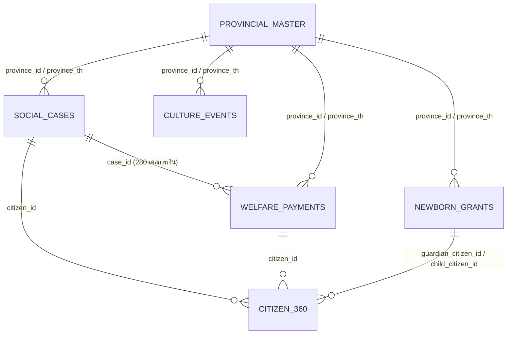

# 📈 DGA_3 — ดัชนีเศรษฐกิจอุตสาหกรรม & สวัสดิการสังคม (Economic Index & Social Welfare Analytics)

[](https://www.python.org/)
[](https://scikit-learn.org/)
[](https://plotly.com/)
[](#-g5--ดัชนีเศรษฐกิจอุตสาหกรรม-group_5)
[](#-มาตรฐานการแปลงข้อมูล-data-transformation-standards)

โครงการนี้แปลงรายงาน Excel ของหน่วยงานภาครัฐที่ **จัดรูปแบบมาเพื่อให้คนอ่าน** (merged cell, multi-row header, แถวสรุป, เชิงอรรถ, ข้อความไทย, ปี พ.ศ.) ให้กลายเป็น **ชุดข้อมูลมาตรฐานที่เครื่องอ่านได้ (Clean CSV, `utf-8-sig`)** แล้วต่อยอดเป็นการวิเคราะห์เชิงลึกและโมเดล Machine Learning พร้อมข้อเสนอแนะเชิงนโยบาย

> 📍 **ตำแหน่ง:** โฟลเดอร์นี้เป็นส่วนหนึ่งของ repo [`ZouWhatqq/Ta_AJ_Bank`](https://github.com/ZouWhatqq/Ta_AJ_Bank)
> working copy ต้นทางอยู่ที่ `E:\DGA_ALL\DGA_3`

---

## ⚠️ อ่านก่อน — ชื่อโฟลเดอร์ไม่ตรงกับเนื้อหา (Folder Naming Mismatch)

ชื่อโฟลเดอร์ `G3_` และ `G5_` **สลับกันกับเนื้อหาข้างใน** และยังไม่ได้แก้ เพราะการเปลี่ยนชื่อจะทำให้ path ใน notebook พังทั้งหมด

| โฟลเดอร์จริงบนดิสก์ | เนื้อหาจริงข้างใน | ชื่อที่ควรเป็น | README ภายในเรียกว่า |
|---|---|---|---|
| `G3_เศรษฐกิจอุตสาหกรรม_นโยบายและยุทธศาสตร์การค้า/` | สวัสดิการสังคม (พม.) + ปฏิทินวัฒนธรรม (วธ.) | `G3_วัฒนธรรม_การพัฒนาสังคมและความมั่นคงของมนุษย์` | `group_6/` |
| `G5_วัฒนธรรม_การพัฒนาสังคมและความมั่นคงของมนุษย์/` | ดัชนีราคาผู้ผลิต (สนค.) + ดัชนีการส่งสินค้า (สศอ.) | `G5_เศรษฐกิจอุตสาหกรรม_นโยบายและยุทธศาสตร์การค้า` | `group_5/` |

**ในเอกสารนี้จะเรียกตามเนื้อหาจริง** คือ `group_5` (เศรษฐกิจ) และ `group_6` (สวัสดิการ/วัฒนธรรม)

---

## ⚡ เริ่มต้นใช้งาน (Quick Start)

```powershell
# 1. สร้าง virtual environment
python -m venv venv

# 2. ติดตั้งไลบรารี
.\venv\Scripts\python.exe -m pip install pandas numpy scikit-learn plotly matplotlib seaborn openpyxl statsmodels

# 3. ลงทะเบียน kernel เข้า Jupyter
.\venv\Scripts\Activate.ps1
python -m ipykernel install --user --name=venv --display-name "Python 3.11 (venv)"
```

### รัน Data Pipeline (แปลง Excel → Clean CSV)

```powershell
# ⚠️ รันจาก root ของ DGA_3 — สคริปต์ทั้งหมดย้ายมารวมที่ scripts/ แล้ว
cd DGA_3

# แปลงข้อมูลดัชนีราคาผู้ผลิต (PPI)
.\venv\Scripts\python.exe scripts\process_price_index.py

# แปลงข้อมูลดัชนีการส่งสินค้า (Shipment)
.\venv\Scripts\python.exe scripts\process_shipment.py
```

### ตรวจสอบความถูกต้อง (Automated Validation)

```powershell
.\venv\Scripts\python.exe scripts\validate_output.py      # ตรวจสอบ PPI
.\venv\Scripts\python.exe scripts\validate_shipment.py    # ตรวจสอบ Shipment
```

*สคริปต์ตรวจสอบเปรียบเทียบข้อมูลทุกแถวและทุกตัวเลขในไฟล์ CSV กับไฟล์ Excel ต้นฉบับแบบ **1:1** เพื่อรับประกันความถูกต้อง 100%*

**แก้ปัญหากราฟ Plotly ไม่แสดงผลใน VS Code (BUG-001)** — โค้ดใน notebook ตั้งค่าไว้แล้ว:

```python
import plotly.io as pio
pio.renderers.default = 'notebook'
```

---

## 🏭 G5 — ดัชนีเศรษฐกิจอุตสาหกรรม (`group_5`)

📁 `G5_วัฒนธรรม_การพัฒนาสังคมและความมั่นคงของมนุษย์/` · 📄 [README ภายใน](G5_วัฒนธรรม_การพัฒนาสังคมและความมั่นคงของมนุษย์/README.md)

### ชุดข้อมูล (Datasets)

| ชุดข้อมูล | หน่วยงาน | มาตรฐาน | ปีฐาน | ไฟล์ต้นฉบับ |
|---|---|---|:---:|---|
| **ดัชนีราคาผู้ผลิต (PPI)** | สำนักงานนโยบายและยุทธศาสตร์การค้า (สนค.) กระทรวงพาณิชย์ | **CPA** (Classification of Products by Activity) | 2564 = 100 | `ดัชนีราคาผู้ผลิต_(เม.ย/พ.ค/มิ.ย 69).xlsx` |
| **ดัชนีการส่งสินค้า (Shipment Index)** | สำนักงานเศรษฐกิจอุตสาหกรรม (สศอ.) กระทรวงอุตสาหกรรม | **TSIC 2552** (Thailand Standard Industrial Classification) | 2559 = 100 | `Shipment.xlsx` |

**มิติเวลา:** 66 เดือน — มกราคม 2564 ถึง มิถุนายน 2569

### โครงสร้างลำดับชั้น (Hierarchy)

| มาตรฐาน | ระดับ | จำนวนแถว |
|---|---|---:|
| **CPA** (PPI) | L0 รวมทุกรายการ → L1 ภาคหลัก (3) → L2 กลุ่มสินค้า (32) → L3 รายการย่อย (54) | 90 |
| **TSIC** (Shipment) | L0 `TOTAL` (1) → L1 `DIVISION_2DIGIT` (22) → L2 `GROUP_4DIGIT` (75) → L3 `CLASS_5DIGIT` (136) → L4 `PRODUCT_ITEM` (289) | 523 |

### Clean CSV ที่ได้

| ไฟล์ | ขนาดข้อมูล | รูปแบบ |
|---|---|---|
| `ppi_monthly_2026_04/05/06.csv` | 90 แถว × 18 คอลัมน์ (ต่อไฟล์) | รายเดือนแยกไฟล์ |
| `ppi_timeseries_master.csv` | 270 แถว × 18 คอลัมน์ | Wide — รวมทุกเดือน |
| `ppi_tidy_timeseries.csv` | 270 แถว × 13 คอลัมน์ | **Tidy Long** — พร้อมทำ BI / ML |
| `shipment_index_wide.csv` | 523 แถว × 83 คอลัมน์ | Wide Matrix (66 คอลัมน์ดัชนีรายเดือน) |
| `shipment_index_tidy_timeseries.csv` | **34,518 แถว × 22 คอลัมน์** | **Tidy Long** — พร้อมทำ SQL / Power BI / Forecasting |

### 📓 Notebooks

| ไฟล์ | เนื้อหา |
|---|---|
| [`ppi_data_analysis.ipynb`](G5_วัฒนธรรม_การพัฒนาสังคมและความมั่นคงของมนุษย์/ppi_data_analysis.ipynb) | 🎓 **PPI Data Science Life Cycle** 6 ขั้น — Load → Understand → Clean → EDA → **K-Means + PCA** → Executive Insights |
| [`ppi_ml_modeling.ipynb`](G5_วัฒนธรรม_การพัฒนาสังคมและความมั่นคงของมนุษย์/ppi_ml_modeling.ipynb) | 🚀 **Supervised ML บน PPI** — Lag Features (เลี่ยง Data Leakage) → Model A: Regression ทำนาย YoY เดือนถัดไป → Model B: Classification "เงินเฟ้อจะเร่งขึ้นไหม" |
| [`shipment_data_analysis.ipynb`](G5_วัฒนธรรม_การพัฒนาสังคมและความมั่นคงของมนุษย์/shipment_data_analysis.ipynb) | 🚢 **Shipment Life Cycle เต็มรูปแบบ** — TSIC 66 เดือน + Holt-Winters Forecasting + Clustering |
| [`shipment_goal_analysis.ipynb`](G5_วัฒนธรรม_การพัฒนาสังคมและความมั่นคงของมนุษย์/shipment_goal_analysis.ipynb) | 🎯 **โจทย์เฉพาะกิจ 3 ข้อ** — Macro Trends · Top 10 ระดับ `PRODUCT_ITEM` รายปี · เจาะลึกอิเล็กทรอนิกส์ (TSIC 26) + Prediction Ribbon 12 เดือน |
| [`data_analysis.ipynb`](G5_วัฒนธรรม_การพัฒนาสังคมและความมั่นคงของมนุษย์/data_analysis.ipynb) | 📊 **บูรณาการข้ามหน่วยงาน** — PPI ⟷ Shipment 4-Quadrant Bubble (ราคาต้นทุน vs ปริมาณส่งสินค้า) + Forecast Fan Chart + Seasonality Heatmap + TSIC Weights Treemap |

📑 [`TSIC_SHIPMENT_VALIDATION_REPORT.md`](G5_วัฒนธรรม_การพัฒนาสังคมและความมั่นคงของมนุษย์/TSIC_SHIPMENT_VALIDATION_REPORT.md) — รายงานสอบทานการแปลงข้อมูลเทียบคู่มือ TSIC 2552 ของ สสช. 2 เล่ม (รวม 1,007 หน้า) ยืนยันความถูกต้อง **100% ทุกระดับชั้น**

---

## 🏛️ G3 — สวัสดิการสังคม & วัฒนธรรม (`group_6`)

📁 `G3_เศรษฐกิจอุตสาหกรรม_นโยบายและยุทธศาสตร์การค้า/` · 📄 [README ภายใน](G3_เศรษฐกิจอุตสาหกรรม_นโยบายและยุทธศาสตร์การค้า/README.md) · 🎯 [breif.md](G3_เศรษฐกิจอุตสาหกรรม_นโยบายและยุทธศาสตร์การค้า/breif.md)

### ชุดข้อมูล (Datasets)

| ชุดข้อมูล | หน่วยงาน | ลักษณะ | ขนาด | ไฟล์ผลลัพธ์ |
|---|---|:---:|:---:|---|
| ผู้ประสบปัญหาทางสังคมที่ได้รับความช่วยเหลือ | **พม.** | Synthetic | 500 × 36 | `clean_mso_social_cases.csv` |
| การช่วยเหลือเงินสงเคราะห์ | **พม.** | Synthetic | 500 × 41 | `clean_mso_welfare_payments.csv` |
| เงินอุดหนุนเด็กแรกเกิด | **พม.** | Synthetic | 500 × 42 | `clean_mso_newborn_grants.csv` |
| ฐานข้อมูลประชาชนแบบองค์รวม (Citizen 360) | บูรณาการภายใน พม. | Derived Master | 420 × 23 | `clean_mso_citizen_360.csv` |
| ปฏิทินเทศกาลประเพณีและกิจกรรมสำคัญ | **วธ.** | **Real Open Data (API)** | 200 กิจกรรม × 37 | `clean_culture_events.csv` |
| ตารางสรุปบูรณาการระดับจังหวัด | บูรณาการ พม. × วธ. | Integrated Master | 77 × 21 | `provincial_integrated_master.csv` |

### 🔗 ความสัมพันธ์ของข้อมูล (Relational Model)



### 🎯 โจทย์เชิงยุทธศาสตร์ 3 มิติ

| # | มิติ | วิธีการ |
|---|---|---|
| 1 | ⚡ **Operations & SLA** | วิเคราะห์กระบวนการตั้งแต่รับเรื่องถึงจ่ายเงิน ใช้ ML ทำนายคอขวดและเคสเสี่ยงล่าช้า เพื่อ fast-track เงินช่วยเหลือถึงกลุ่มเปราะบางทันเวลา |
| 2 | 👥 **Citizen 360 & Personas** | รวมประวัติรับสวัสดิการแบบ Single View → **K-Means Clustering** จัดกลุ่มความเปราะบางเป็น Persona (ผู้สูงอายุพึ่งพิง, แม่เลี้ยงเดี่ยว ฯลฯ) |
| 3 | 🗺️ **Geospatial & Cross-Domain** | เชื่อม 77 จังหวัด วิเคราะห์ความเหลื่อมล้ำทางสังคมคู่กับต้นทุนทางวัฒนธรรม เสนอใช้ Soft Power / เทศกาลท้องถิ่นสร้างรายได้ชุมชน |

### 📓 Notebooks

| ไฟล์ | เนื้อหา |
|---|---|
| [`mso_culture_goal_analysis.ipynb`](G3_เศรษฐกิจอุตสาหกรรม_นโยบายและยุทธศาสตร์การค้า/mso_culture_goal_analysis.ipynb) | 🏛️ ตอบโจทย์ทั้ง 3 มิติ — SLA Optimization → Citizen 360 Persona Clustering → บูรณาการ พม. × วธ. 77 จังหวัด → Executive KPI + ข้อเสนอแนะเชิงนโยบาย |
| [`newborn_child_grant_district_analysis.ipynb`](G3_เศรษฐกิจอุตสาหกรรม_นโยบายและยุทธศาสตร์การค้า/newborn_child_grant_district_analysis.ipynb) | 👶 เงินอุดหนุนเด็กแรกเกิด **ระดับอำเภอทั่วประเทศ** — Geospatial Enrichment → EDA → Time Series & Seasonality → แผนที่ไทย → District Clustering + Delay Risk Classification → Policy Roadmap |

### 🧹 การปรับปรุงคุณภาพข้อมูลที่ทำเพิ่ม

| ปัญหาที่พบในข้อมูลต้นทาง | วิธีแก้ใน pipeline |
|---|---|
| HTML tags / entities ปะปนในคำอธิบายกิจกรรม (`&lt;a&gt;`, `&quot;`, `<span>`) | เขียนฟังก์ชัน decode + strip tags ให้เหลือข้อความพร้อมทำ NLP |
| พิกัด lat/lng ~58% เป็นค่า default ของส่วนกลาง กทม. (`13.766913, 100.576203`) | Impute ด้วย **Provincial Centroid** พร้อมระบุที่มาในคอลัมน์ `coord_source` |
| `event_category` เป็นรหัสอ่านไม่รู้เรื่อง | Map เป็นชื่อหมวดภาษาไทย (ประเพณีและศาสนา, เทศกาลประจำปี, อาหารและวิถีชีวิต) |
| ข้อมูลภาษาอังกฤษว่าง ~50–60% | บันทึกเป็นข้อเสนอแนะกลับไปยังหน่วยงานเจ้าของข้อมูล |

📄 [`DATA_REVIEW_FEEDBACK_CHAT.txt`](DATA_REVIEW_FEEDBACK_CHAT.txt) — สรุปผล review คุณภาพข้อมูลทั้ง 2 กลุ่ม สำหรับส่งกลับหน่วยงาน

---

## 📂 แผนผังโฟลเดอร์ (Repository Structure)

```text
DGA_3/
│
├── README.md                                       คำอธิบายโครงการนี้
├── CLAUDE.md                                       คู่มือ agent + มาตรฐานการ clean data
├── DATA_REVIEW_FEEDBACK_CHAT.txt                   สรุปผล review คุณภาพข้อมูลส่งหน่วยงาน
│
├── scripts/                                     🛠️ Data pipeline (รวมจาก root เดิม)
│   ├── process_price_index.py                      xlsx → clean CSV (PPI)
│   ├── process_shipment.py                         xlsx → clean CSV (Shipment)
│   ├── validate_output.py                          ตรวจสอบ PPI เทียบ Excel 1:1
│   ├── validate_shipment.py                        ตรวจสอบ Shipment เทียบ Excel 1:1
│   ├── execute_notebook.py                         รัน notebook แบบ headless
│   ├── build_group6_notebook.py                    generate notebook พม./วธ.
│   ├── build_newborn_district_notebook.py          generate notebook เงินอุดหนุนเด็กแรกเกิด
│   └── update_goal_notebook.py                     อัปเดตเซลล์ใน goal notebook
│
├── G5_วัฒนธรรม_การพัฒนาสังคมและความมั่นคงของมนุษย์/    ⚠️ เนื้อหาจริง = group_5 (เศรษฐกิจ)
│   ├── raw/                                        ไฟล์ Excel ต้นฉบับ
│   │   ├── Shipment.xlsx
│   │   ├── ดัชนีราคาผู้ผลิต_(เม.ย 69).xlsx
│   │   ├── ดัชนีราคาผู้ผลิต_(พ.ค 69).xlsx
│   │   ├── ดัชนีราคาผู้ผลิต_(มิ.ย 69).xlsx
│   │   └── ⚠️ สสช. TSIC*.pdf                       (ไม่อยู่ใน repo — คู่มือ 8.58 MB)
│   ├── clean_csv/                                  Clean CSV มาตรฐาน utf-8-sig
│   │   ├── ppi_monthly_2026_04.csv                 PPI เม.ย. 2569 (90 แถว)
│   │   ├── ppi_monthly_2026_05.csv                 PPI พ.ค. 2569 (90 แถว)
│   │   ├── ppi_monthly_2026_06.csv                 PPI มิ.ย. 2569 (90 แถว)
│   │   ├── ppi_timeseries_master.csv               PPI Wide (270 แถว)
│   │   ├── ppi_tidy_timeseries.csv                 PPI Tidy Long (270 แถว)
│   │   ├── shipment_index_wide.csv                 Shipment Wide (523 × 83)
│   │   └── shipment_index_tidy_timeseries.csv      Shipment Tidy Long (34,518 × 22)
│   ├── fonts/Prompt/                               18 ไฟล์ TTF — จำเป็นสำหรับ matplotlib ภาษาไทย
│   ├── ppi_data_analysis.ipynb                     🎓 PPI Life Cycle + K-Means/PCA
│   ├── ppi_ml_modeling.ipynb                       🚀 PPI Lag Features → Regression + Classification
│   ├── shipment_data_analysis.ipynb                🚢 Shipment TSIC + Holt-Winters
│   ├── shipment_goal_analysis.ipynb                🎯 Top 10 + อิเล็กทรอนิกส์ TSIC 26
│   ├── data_analysis.ipynb                         📊 PPI ⟷ Shipment 4-Quadrant + Forecast
│   ├── TSIC_SHIPMENT_VALIDATION_REPORT.md          📑 รายงานสอบทาน TSIC
│   └── README.md
│
└── G3_เศรษฐกิจอุตสาหกรรม_นโยบายและยุทธศาสตร์การค้า/    ⚠️ เนื้อหาจริง = group_6 (สวัสดิการ/วัฒนธรรม)
    ├── raw/                                        ข้อมูลดิบต้นฉบับ
    │   ├── events.json                             JSON ข้อมูลเปิดของ วธ.
    │   ├── ผู้ประสบปัญหาทางสังคมที่ได้รับความช่วยเหลือ/
    │   ├── การช่วยเหลือเงินสงเคราะห์/
    │   ├── เด็กแรกเกิด - การจ่ายเงินอุดหนุนเด็กแรกเกิด/
    │   └── ข้อมูลการจ่ายเงินอุดหนุนเด็กแรกเกิด/       (ฉบับ real location)
    ├── clean/                                      Clean CSV มาตรฐาน utf-8-sig
    │   ├── clean_mso_social_cases.csv              500 × 36 (SLA, กลุ่มอายุ, ภาค)
    │   ├── clean_mso_welfare_payments.csv          500 × 41 (% การจ่าย, ยอดคงค้าง)
    │   ├── clean_mso_newborn_grants.csv            500 × 42 (รายได้ครัวเรือน, วงเงิน)
    │   ├── clean_mso_citizen_360.csv               420 × 23 (Single View of Citizen)
    │   ├── clean_culture_events.csv                200 กิจกรรม × 37 (clean HTML, impute พิกัด)
    │   ├── provincial_integrated_master.csv        77 × 21 (พม. × วธ. รายจังหวัด)
    │   └── datadict_*.csv                          data dictionary
    ├── process_clean_csv.py                        pipeline เฉพาะกลุ่มนี้
    ├── mso_culture_goal_analysis.ipynb             🏛️ SLA + Citizen 360 + บูรณาการ 77 จังหวัด
    ├── newborn_child_grant_district_analysis.ipynb 👶 เงินอุดหนุนเด็กแรกเกิดระดับอำเภอ
    ├── breif.md                                    สรุปโจทย์ 3 มิติเชิงยุทธศาสตร์
    ├── DATA_REVIEW_FEEDBACK_CHAT.txt
    └── README.md
```

---

## 📐 มาตรฐานการแปลงข้อมูล (Data Transformation Standards)

| # | หัวข้อ | กติกา |
|---|---|---|
| 1 | **Encoding** | บันทึก CSV ที่มีภาษาไทยด้วย `utf-8-sig` เสมอ — Excel เปิดแล้วไม่เพี้ยน |
| 2 | **Header Normalization** | ยุบ multi-level / merged header เป็นชื่อคอลัมน์ snake_case ชั้นเดียว ตัด footnote และ title block ออกจากแถวข้อมูล |
| 3 | **Data Types** | ตัวเลขต้อง parse เป็น numeric — ตัด `,` ออก, จัดการ `-`, `N/A`, ช่องว่าง → NaN หรือ 0 ตาม schema |
| 4 | **Date / พ.ศ. → ค.ศ.** | เก็บทั้ง `year_be` และ `year_ce`, ทำ `period_ym` เป็น ISO `YYYY-MM` |
| 5 | **Hierarchical Unpivoting** | แตกหมวดหมู่ที่ merge/indent เป็นคอลัมน์ระดับชั้นชัดเจน (`category_level`, `level_type`, `*_code`, `*_name`) |
| 6 | **No Loss of Metadata** | เก็บ `source_file`, `source_agency`, `base_year` ไว้เป็นคอลัมน์ทุกครั้ง |
| 7 | **Validation** | ทุก pipeline ต้องมีสคริปต์ตรวจสอบเทียบ 1:1 กับไฟล์ต้นฉบับ |

---

## ⚠️ ไฟล์ที่ไม่ได้อยู่ใน repo

| ไฟล์ | ขนาด | เหตุผล / วิธีได้มา |
|---|---|---|
| `G5_*/raw/สสช. TSICVer.2.pdf` | 2.68 MB | คู่มือ TSIC ดาวน์โหลดจาก [สำนักงานสถิติแห่งชาติ](https://www.nso.go.th) |
| `G5_*/raw/สสช. รวมเล่ม+TSIC+*.pdf` | 5.90 MB | คู่มือ TSIC ดาวน์โหลดจาก สสช. |
| `G3_*/raw/*.rar` | ~1 MB | ไฟล์บีบอัดซ้ำกับโฟลเดอร์ `raw/` ที่แตกไว้แล้ว |
| `*.zip` (`clean.zip`, `clean_csv.zip`, `Prompt.zip`) | ~4 MB | สำเนาซ้ำของโฟลเดอร์ที่ commit อยู่แล้ว |
| `test_*.html` (3 ไฟล์) | 14.05 MB | output ทดสอบชั่วคราวตอน debug กราฟ |
| `inspect_*.py`, `test_*.py` | เล็ก | สคริปต์ throwaway ตอน debug |

---

## 🐛 Known Issues & Lessons Learned

| Bug ID | อาการ / Symptom | แก้ไข / Fix |
|---|---|---|
| **BUG-001** | Plotly `'iframe'` renderer ไม่แสดงผลใน VS Code Jupyter | `import plotly.io as pio; pio.renderers.default = 'notebook'` |
| **BUG-002** | Plotly Category Mismatch / empty data จากช่องว่างซ้ำซ้อนและ data type | `.str.replace(r'  +', ' ', regex=True)` หลัง `.str.strip()` + normalize รหัส TSIC เป็น string 2 หลัก |
| **BUG-003** | matplotlib แสดงภาษาไทยเป็นสี่เหลี่ยม (tofu) | โหลด TTF จาก `./fonts/Prompt` ผ่าน `font_manager.fontManager.addfont()` |

รายละเอียดเต็มดูใน [`CLAUDE.md`](CLAUDE.md)

---

## 🌐 แหล่งข้อมูล (Data Sources & Credits)

| ชุดข้อมูล | หน่วยงาน | ลิงก์ |
|---|---|---|
| ดัชนีราคาผู้ผลิต (PPI) | สำนักงานนโยบายและยุทธศาสตร์การค้า (สนค.) กระทรวงพาณิชย์ | [tpso.go.th](https://www.tpso.go.th) · [data.go.th](https://data.go.th) |
| ดัชนีการส่งสินค้า (Shipment Index) | สำนักงานเศรษฐกิจอุตสาหกรรม (สศอ.) กระทรวงอุตสาหกรรม | [oie.go.th](https://www.oie.go.th) · [data.go.th](https://data.go.th) |
| มาตรฐาน TSIC 2552 | สำนักงานสถิติแห่งชาติ (สสช.) | [nso.go.th](https://www.nso.go.th) |
| ข้อมูลสวัสดิการสังคม (Synthetic) | กระทรวงการพัฒนาสังคมและความมั่นคงของมนุษย์ (พม.) | [m-society.go.th](https://www.m-society.go.th) |
| ปฏิทินเทศกาลประเพณี (Real Open Data) | กระทรวงวัฒนธรรม (วธ.) | [m-culture.go.th](https://www.m-culture.go.th) · [data.go.th](https://data.go.th) |
